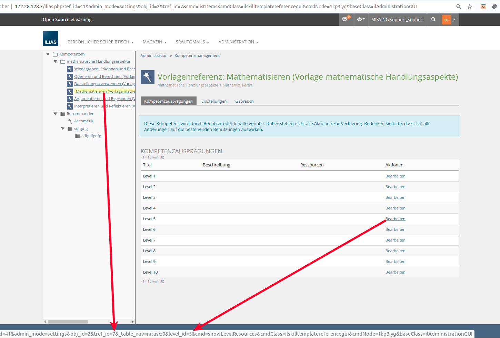
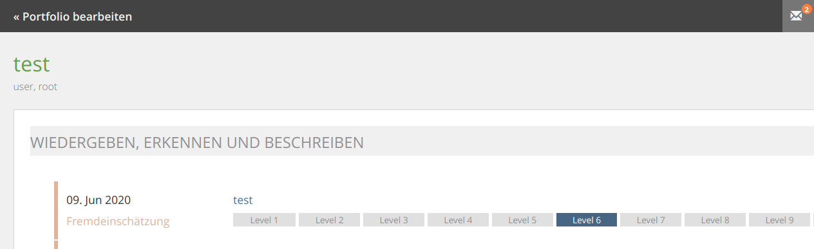
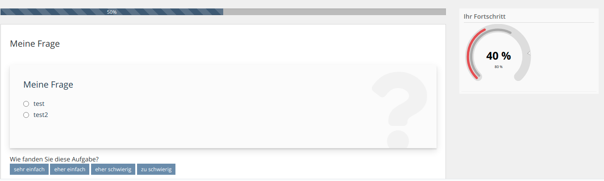

ILIAS-Plugin DhbwTraining
============


## Installation
Start at your ILIAS root directory
```bash
mkdir -p Customizing/global/plugins/Services/Repository/RepositoryObject
cd Customizing/global/plugins/Services/Repository/RepositoryObject
git clone https://github.com/studer-raimann/DhbwTraining.git
```
As ILIAS administrator go to "Administration->Plugins" and install/activate the plugin.  

## Usage
### Competences

"competences": {
    "4": 6,
    "7": 5
}



    
### Progress Meters

"progress_meters": [
{
  "progressmeter_type": "0",
  "title": "Ihr Fortschritt",
  "max_width_in_pixel": "",
  "max_reachable_score": "100",
  "required_score": "80",
  "primary_reached_score": "40",
  "secondary_reached_score": "60"
}
]



### Requirements
* ILIAS 5.3
* PHP >=7.0
* Recommender Phython Software

### ILIAS Plugin SLA

Wir lieben und leben die Philosophie von Open Source Software! Die meisten unserer Entwicklungen, welche wir im Kundenauftrag oder in Eigenleistung entwickeln, stellen wir öffentlich allen Interessierten kostenlos unter https://github.com/studer-raimann zur Verfügung.

Setzen Sie eines unserer Plugins professionell ein? Sichern Sie sich mittels SLA die termingerechte Verfügbarkeit dieses Plugins auch für die kommenden ILIAS Versionen. Informieren Sie sich hierzu unter https://studer-raimann.ch/produkte/ilias-plugins/plugin-sla.

Bitte beachten Sie, dass wir nur Institutionen, welche ein SLA abschliessen Unterstützung und Release-Pflege garantieren.

### Contact
support-core1@studer-raimann.ch  
https://studer-raimann.ch  
